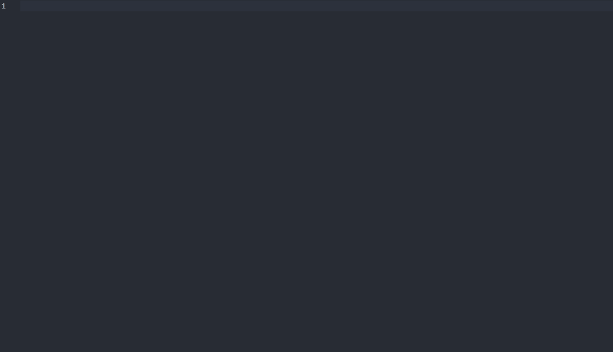

  

<h3 align="center">Axentix snippets</h3>

  <a href="https://useaxentix.com/"><strong>Home</strong></a> |
  <a href="https://useaxentix.com/docs/"><strong>Documentation</strong></a>

 

# Snippets

This repo contains all the snippets code you can get by downloading the VSCode [Axentix Snippets](https://marketplace.visualstudio.com/items?itemName=AxentixTeam.axentix-snippets) extension.

## Preview

## Features

All components have autocomplete, get the whole component snippets list here :

[Browse all snippets](https://github.com/axentix/snippet-ax/tree/master/snippets)

## Documentation
​
Find the documentation at <https://useaxentix.com/docs/>.

## Creators
- Vincent Di Marco - (Vincentdm31)  
  [Github](https://github.com/Vincentdm31)  
  [Linkedin](https://www.linkedin.com/in/vincentdimarco/)

- Axel SIMONET - (Xelzs)  
  [Github](https://github.com/Xelzs)  
  [Linkedin](https://www.linkedin.com/in/axel-simonet/)  
  [Website](https://axelsimonet.fr/)

- Vincent LEVEQUE - (Stallos11)  
  [Github](https://github.com/Stallos11)  
  [Linkedin](https://www.linkedin.com/in/leveque-vincent/)
